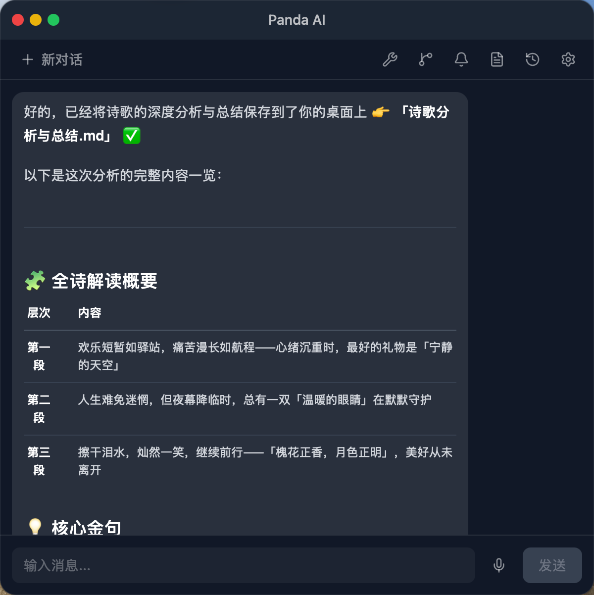
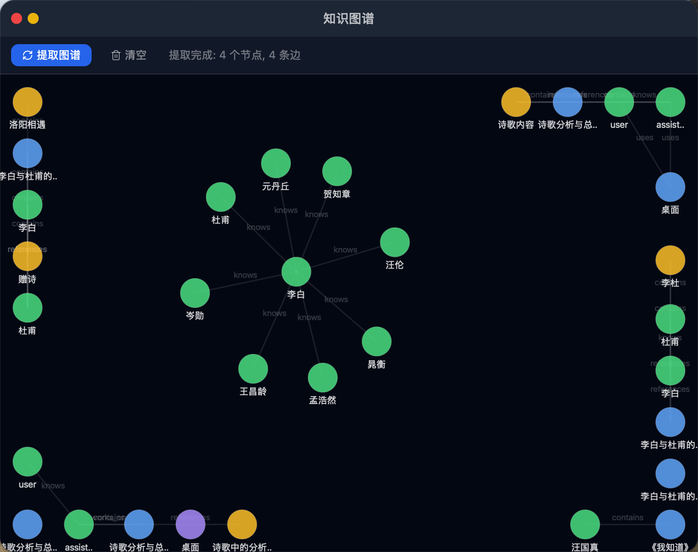
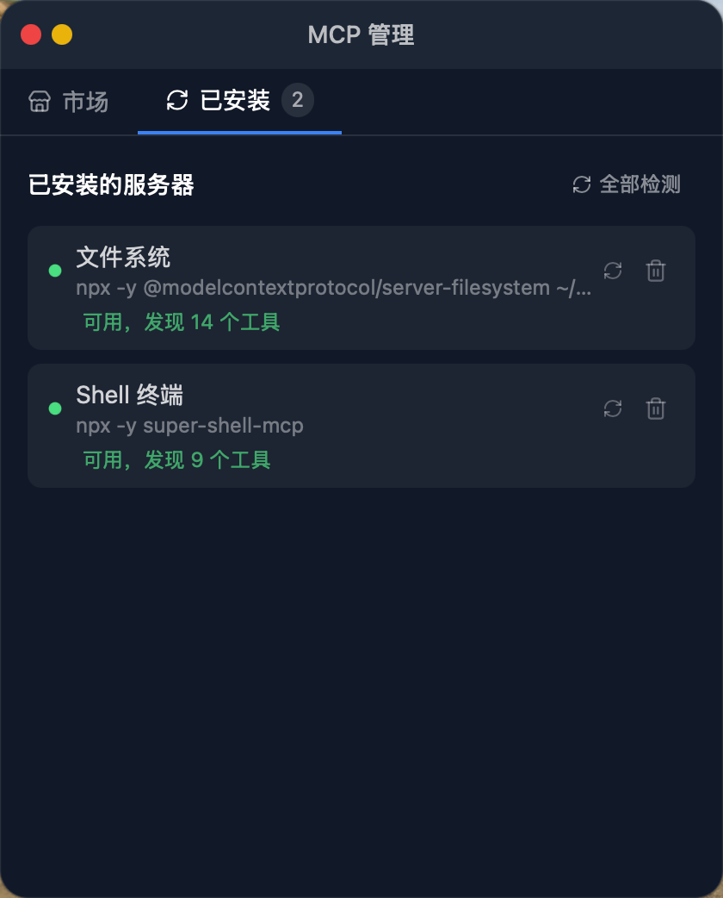

# Panda AI 桌面助手

一个基于 Tauri 2.0 构建的桌面 AI 助手，以熊猫桌宠形态呈现，支持语音对话、聊天交互、知识库管理、MCP 工具集成和知识图谱等功能。


## 功能概览

### 桌宠交互
- **熊猫桌宠** — 桌面宠物常驻桌面，支持拖拽移动、边缘吸附（贴近屏幕边缘自动对齐）
- **互动反馈** — 单击熊猫触发随机趣味互动语，双击启动语音对话
- **右键菜单** — 右键点击显示快捷菜单（新对话、API 配置、历史记录、退出）
- **径向菜单** — 鼠标右键弹出多功能径向菜单（互动、聊天、配置、历史、退出）
- **多种状态动画** — idle、thinking、sleep、happy、angry、error 等状态切换
- **语音波浪动画** — 语音模式下显示环形声波动画（录音绿色、倾听灰色、TTS 蓝色）

### AI 对话
- **文字聊天** — 完整的聊天界面，支持 Markdown 渲染（代码块、表格、链接等）
- **语音对话** — 双击熊猫开始语音对话，支持 VAD（语音活动检测），自动转录为文字
- **TTS 播报** — AI 回复后自动语音朗读（Edge TTS），支持打断
- **流式输出** — AI 回复实时流式显示，支持多轮对话
- **全局快捷键** — `Option+Space`（Mac）/ `Alt+Space`（Windows）快速启动语音对话
- **多窗口设计** — 桌宠窗口与聊天窗口分离，互不干扰

### 知识库
- **文件导入** — 支持导入 PDF、TXT、代码文件等，自动分块并向量化存储
- **语义搜索** — 对话时自动检索相关知识片段作为上下文
- **文件管理** — 查看、删除已导入的知识文件

### MCP 工具集成
- **MCP 协议支持** — 集成 Model Context Protocol，扩展 AI 能力
- **预置模板** — 内置文件系统、Shell 终端等 MCP 服务器模板
- **自定义服务器** — 支持添加自定义 MCP 服务器（命令+参数）
- **连接检测** — 测试 MCP 服务器连通性并发现可用工具

### 知识图谱
- **图谱可视化** — 基于 d3-force 的力导向图，展示实体关系
- **自动抽取** — 从对话中自动抽取知识点和关系
- **交互操作** — 拖拽节点、缩放、查看详情

### 提醒管理
- **创建提醒** — 支持设置提醒时间和描述
- **完成/删除** — 标记完成或删除提醒
- **定时检查** — 自动检查到期提醒并通知

### 配置管理
- **API 配置** — 支持自定义 LLM API（Base URL、API Key、Model）
- **语音配置** — 独立的语音识别 API 配置（支持 Groq 等第三方 STT）
- **连接测试** — 一键测试 API 连通性

## 界面截图

| 聊天页面 | 知识图谱 | MCP 服务管理 |
|:---:|:---:|:---:|
|  |  |  |

### 桌宠说明

项目使用了 PNG 精灵图作为桌宠资源：

| 文件 | 说明 |
|:---|:---|
| `public/sprites/pet.gif` | 熊猫桌宠动画（GIF 动图） |
| `public/sprites/pet.png` | 熊猫桌宠静态图 |
| `public/sprites/panda.png` | Logo / 封面图 |
| `public/sprites/聊天页面.png` | 聊天界面截图 |
| `public/sprites/知识图谱.png` | 知识图谱界面截图 |
| `public/sprites/MCP服务管理.png` | MCP 服务管理界面截图 |

## 技术栈

| 层级 | 技术 |
|:---|:---|
| 前端框架 | React 18 + TypeScript |
| 构建工具 | Vite 5 |
| 桌面框架 | Tauri 2.0 |
| 样式 | Tailwind CSS 3 |
| 状态管理 | Zustand |
| 后端语言 | Rust |
| 数据库 | SQLite (Diesel ORM) |
| 向量存储 | LanceDB（知识库语义搜索） |
| 图形 | d3-force / d3-drag（知识图谱） |
| 音频 | cpal（录音）、rodio（音频播放） |
| Markdown | react-markdown + remark-gfm |
| 动画 | framer-motion |

## 快速开始

### 前置条件

- **Node.js** >= 18
- **Rust** (latest stable)
- **系统依赖**（Tauri 2.0 所需）：
  - macOS: Xcode Command Line Tools
  - Linux: `libwebkit2gtk-4.1-dev`, `libgtk-3-dev` 等
  - Windows: WebView2（Windows 10 自带）

### 安装

```bash
# 克隆仓库
git clone <repo-url>
cd panda_ai_desktop_agent

# 安装前端依赖
npm install

# 安装 Rust 依赖（自动编译时会下载）
```

### 开发模式

启动开发服务器，支持热更新：

```bash
npm run tauri dev
```

这会同时启动 Vite 开发服务器（端口 1420）和 Tauri 桌面应用。

### 生产构建

```bash
npm run tauri build
```

构建产物位于 `src-tauri/target/release/bundle/` 目录。

### 仅前端开发

如果只需要开发前端部分而不启动 Tauri：

```bash
npm run dev
```

## 项目结构

```
panda_ai_desktop_agent/
├── public/
│   └── sprites/          # 图片资源（桌宠精灵图、截图）
├── src/                  # 前端代码
│   ├── components/
│   │   ├── chat/         # 聊天相关组件
│   │   ├── config/       # 配置面板
│   │   ├── graph/        # 知识图谱
│   │   ├── history/      # 历史记录
│   │   ├── knowledge/    # 知识库
│   │   ├── mcp/          # MCP 服务管理
│   │   ├── panda/        # 熊猫桌宠组件
│   │   ├── reminder/     # 提醒管理
│   │   └── trace/        # Agent 追踪栏
│   ├── hooks/            # React Hooks
│   ├── lib/              # Tauri API 封装
│   └── stores/           # Zustand 状态管理
├── src-tauri/            # 后端代码（Rust）
│   ├── src/
│   │   ├── api/          # LLM API 客户端
│   │   ├── agent/        # AI Agent 逻辑
│   │   ├── commands/     # Tauri 命令
│   │   ├── db/           # 数据库（SQLite）
│   │   ├── mcp/          # MCP 协议传输
│   │   ├── memory/       # 记忆提取
│   │   ├── graph/        # 知识图谱逻辑
│   │   ├── parser/       # 文件解析
│   │   └── voice.rs      # 语音引擎（VAD + 录音）
│   └── Cargo.toml
├── docs/                 # 文档与设计稿
├── package.json
└── README.md
```

## 功能特性详情

### 语音引擎（Voice Engine）
- 基于能量检测的 VAD（Voice Activity Detection）
- 自适应噪声底噪校准
- 可配置静音超时（默认 1.2 秒）
- 支持外部打断（`cancel_voice_chat`）
- 支持多平台音频输入（通过 cpal）

### AI Agent
- 基于 ReAct 模式的 Agent，支持工具调用
- 自动管理对话历史（最近 20 条）
- 集成 MCP 工具，扩展 AI 能力
- 支持流式追踪（plan → execute → observe → done/error）

### 知识库（RAG）
- 基于 LanceDB 的向量检索
- 文件导入自动分块 + 向量化
- 对话时自动检索相关上下文
- 支持 Tokenizer 文本分块

## API 配置说明

### LLM API（文字对话和 Agent）

在配置面板中设置以下参数：
- **Base URL** — API 地址，例如 `https://api.openai.com/v1`
- **API Key** — 你的 API 密钥
- **Model** — 模型名称，例如 `gpt-4o`、`deepseek-chat` 等

### 语音识别（STT）

语音功能需要独立的语音识别 API，推荐使用 **Groq**（免费，速度快）：

1. 打开 [Groq Console](https://console.groq.com/)
2. 注册 / 登录账号
3. 进入 **API Keys** 页面，点击 **Create API Key**
4. 复制生成的 API Key
5. 在应用的语音配置中填入：

| 配置项 | 推荐值 |
|:---|:---|
| STT Base URL | `https://api.groq.com/openai/v1` |
| STT API Key | 你的 Groq API Key |
| STT Model | `whisper-large-v3-turbo` |

Groq 的 `whisper-large-v3-turbo` 模型目前免费，支持多语言语音识别（包括中文），响应速度快。

### TTS（语音播报）

语音播报使用 Edge TTS 服务，无需额外配置。

## 许可证

本项目仅供学习和个人使用。
